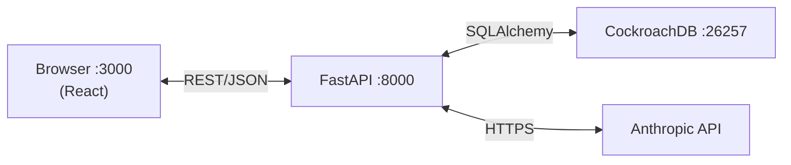
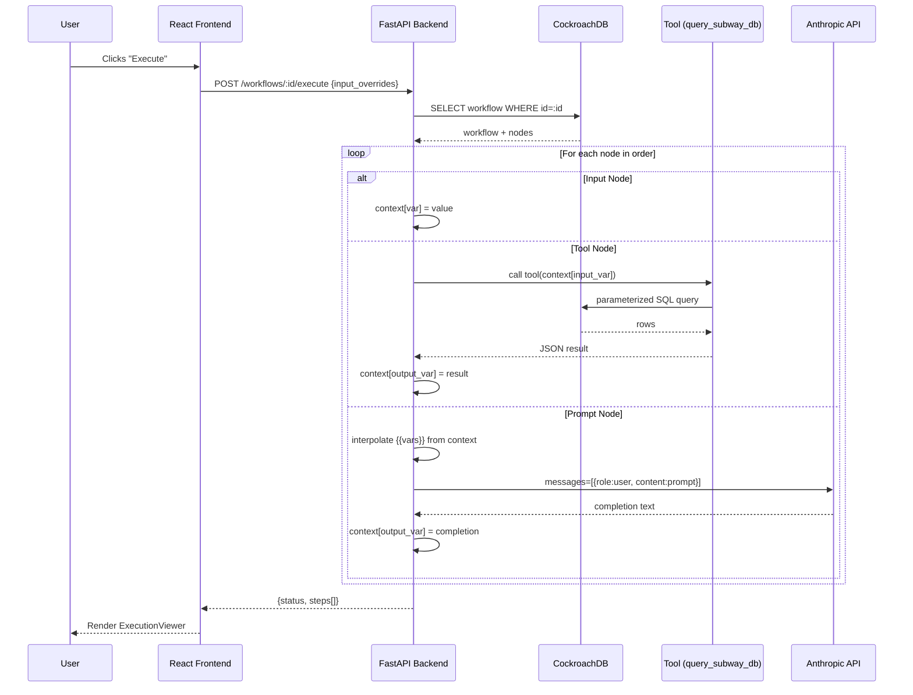

# Micro-Agent Workflow Builder

A visual, full-stack tool for composing and executing multi-step AI workflows. Chain **Input**, **Tool**, and **Prompt** nodes into pipelines that query real data and synthesise results with Claude.

Ships with a pre-loaded **Toronto Subway Analyst** workflow that queries a historical delay dataset and produces a natural-language summary — no configuration beyond an Anthropic API key required.

---

## Quick Start

### Prerequisites

- [Docker](https://docs.docker.com/get-docker/) and [Docker Compose](https://docs.docker.com/compose/) v2+
- An [Anthropic API key](https://console.anthropic.com/)

### Steps

1. **Clone the repo**

   ```bash
   git clone git@github.com:cherrythia/sliver.git
   cd sliver
   ```

2. **Configure your API key**

   ```bash
   cp .env.example .env
   # Open .env and replace the placeholder with your real Anthropic API key
   ```

3. **Start everything**

   ```bash
   docker compose up --build
   ```

   On first run the backend seeds the database with the Toronto Subway dataset and workflow (~30 seconds). Subsequent runs skip seeding.

4. **Open the services**

   | Service | URL |
   |---|---|
   | App (React) | http://localhost:3000 |
   | API | http://localhost:8000 |
   | CockroachDB Console | http://localhost:8080 |
   | Adminer (DB browser) | http://localhost:8081 |

   For Adminer, log in with: System = **PostgreSQL**, Server = `db:26257`, Username = `root`, Password = *(blank)*.

---

## How It Works

Workflows are directed pipelines of **nodes** that execute sequentially. Each node type has a distinct role:

| Node type | Purpose |
|-----------|---------|
| **Input** | Declares a named variable and its default value. The user can override it at execution time. |
| **Tool** | Calls a registered Python function (e.g. `query_subway_db`) and stores the result in a context variable. |
| **Prompt** | Renders a Jinja-style template (`{{variable}}`), sends it to Claude, and stores the completion. |

The pre-loaded **Toronto Subway Analyst** workflow works as follows:

1. An **Input** node accepts a natural-language question (default: *"Which stations have the worst average delay?"*).
2. A **Tool** node passes the question to `query_subway_db`, which uses Claude Haiku to extract SQL parameters and runs a parameterised query against the historical CSV data loaded into CockroachDB.
3. A **Prompt** node sends the raw query results plus the original question to Claude and returns a polished, human-readable answer.

---

## Architecture



| Layer | Technology |
|-------|-----------|
| Frontend | Vite + React + TypeScript, Zustand, dnd-kit |
| Backend | FastAPI, SQLAlchemy (sync), Pydantic v2 |
| Database | CockroachDB v24.3 — workflows stored as JSON, UUID PKs |
| AI | Anthropic Claude Haiku (query param extraction + prompt responses) |
| Infrastructure | Docker Compose |

---

## Save Workflow Sequence


---

## Execute Workflow Sequence



---

## Design Decisions

**JSON for nodes** — Nodes are always read and written as a complete unit (the whole workflow graph). There is no query pattern that needs individual node rows, so a normalised `nodes` table would add complexity with no benefit. JSON lets the schema evolve freely without migrations.

**CockroachDB over PostgreSQL** — CockroachDB provides distributed SQL with automatic sharding and replication, making the data layer resilient and horizontally scalable. It speaks the PostgreSQL wire protocol so psycopg2, SQLAlchemy, and Adminer work without modification. UUID primary keys on `subway_delays` distribute writes evenly across ranges; sequential integers would create hotspots in a distributed system.

**Adminer for DB access** — A single ~25 MB PHP container replaces heavier tools. Connect via the PostgreSQL driver at `db:26257` since CockroachDB is wire-compatible.

**Sequential execution engine** — A simple ordered loop is easy to reason about, test, and debug. Parallelism is not needed for the current use-case and would complicate context passing and error attribution.

**Zustand for frontend state** — Zustand provides a global store with minimal boilerplate and no wrapping context providers. The workflow canvas and the execution viewer share state without prop-drilling.

**Claude Haiku for SQL parameter extraction** — The `query_subway_db` tool needs to parse a natural-language question into a small JSON object (station name, date range, metric). Haiku is fast and cheap for this structured extraction task; a heavier model would add latency without improving accuracy on such a narrow schema.

**Sync SQLAlchemy instead of async** — The synchronous ORM is simpler to configure, test, and reason about for this scope. The FastAPI endpoints are not I/O-bound enough to benefit from full async database access.

---

## What Would Change With More Time

- **Parallel branches** — Today the execution engine in `app/core/engine.py` processes every node in strict order, one at a time. If two Tool nodes are independent (neither feeds the other), they could be grouped by an `order` field and executed concurrently with `asyncio.gather`. This would unlock fan-out/fan-in patterns: for example, one branch queries delays by station while another queries by date range, and a downstream Prompt node synthesises both results. The node schema, engine loop, and frontend canvas would all need updates to express and visualise branching.

- **Execution history persisted to DB** — Currently nothing is saved when a workflow runs; results live only in React state until the page is refreshed. Adding an `execution_runs` table (a new Alembic migration and SQLAlchemy model) would record every run: which workflow, what input overrides were applied, each node's output, start/end timestamps, and success or failure. The UI could then expose a history panel showing all past runs side-by-side, making it easy to compare how a workflow's output changes as its nodes are edited over time.

- **Auth and per-user workflow isolation** — Right now all workflows in the database are visible to anyone who can reach the API. Adding JWT-based authentication (e.g. via FastAPI's `OAuth2PasswordBearer`) would gate every endpoint behind a verified identity. Pairing that with CockroachDB's row-level security policies — `CREATE POLICY ... USING (owner_id = current_user_id())` — would enforce at the database layer that each user can only read, update, or delete their own workflows, even if the application layer had a bug.
