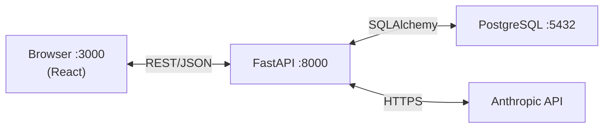
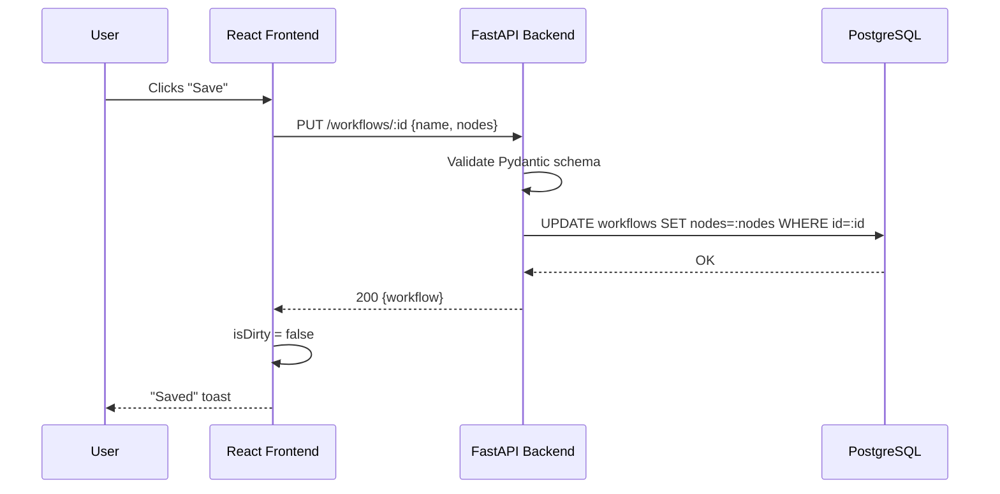

# Micro-Agent Workflow Builder

A visual, full-stack tool for composing and executing multi-step AI workflows. Chain **Input**, **Tool**, and **Prompt** nodes into pipelines that query real data and synthesise results with Claude.

Ships with a pre-loaded **Toronto Subway Analyst** workflow that queries a historical delay dataset and produces a natural-language summary — no configuration beyond an Anthropic API key required.

---

## Quick Start

### Prerequisites

- [Docker](https://docs.docker.com/get-docker/) and [Docker Compose](https://docs.docker.com/compose/) v2+
- An [Anthropic API key](https://console.anthropic.com/)

### Steps

1. **Enter the repo**

   ```bash
   cd silver
   ```

2. **Configure your API key**

   ```bash
   cp .env.example .env
   # Open .env and replace the placeholder with your real key
   ```

3. **Start everything**

   ```bash
   docker compose up --build
   ```

   On first run the backend seeds the database with the sample Toronto Subway workflow. Subsequent runs skip seeding.

4. **Open the app**

   Navigate to [http://localhost:3000](http://localhost:3000).

---

## How It Works

Workflows are directed pipelines of **nodes** that execute sequentially. Each node type has a distinct role:

| Node type | Purpose |
|-----------|---------|
| **Input** | Declares a named variable and its default value. The user can override it at execution time. |
| **Tool** | Calls a registered Python function (e.g. `query_subway_db`) and stores the result in a context variable. |
| **Prompt** | Renders a Jinja-style template (`{{variable}}`), sends it to Claude, and stores the completion. |

The pre-loaded **Toronto Subway Analyst** workflow works as follows:

1. An **Input** node accepts a natural-language question (default: *"Which stations have the worst average delay?"*).
2. A **Tool** node passes the question to `query_subway_db`, which uses Claude Haiku to extract SQL parameters and runs a parameterised query against the historical CSV data loaded into PostgreSQL.
3. A **Prompt** node sends the raw query results plus the original question to Claude and returns a polished, human-readable answer.

---

## Architecture



| Layer | Technology |
|-------|-----------|
| Frontend | Vite + React + TypeScript, Zustand, React Flow |
| Backend | FastAPI, SQLAlchemy (sync), Pydantic v2 |
| Database | PostgreSQL 15 — workflows stored as JSONB |
| AI | Anthropic Claude (Haiku for extraction, Sonnet for summaries) |
| Infrastructure | Docker Compose |

---

## Save Workflow Sequence



---

## Execute Workflow Sequence


---

## Design Decisions

**JSONB for nodes** — Nodes are always read and written as a complete unit (the whole workflow graph). There is no query pattern that needs individual node rows, so a normalised `nodes` table would add complexity with no benefit. JSONB lets the schema evolve freely without migrations.

**Sequential execution engine** — A simple ordered loop is easy to reason about, test, and debug. Parallelism is not needed for the current use-case and would complicate context passing and error attribution.

**Zustand for frontend state** — Zustand provides a global store with minimal boilerplate and no wrapping context providers. The workflow canvas and the execution viewer share state without prop-drilling.

**Claude Haiku for SQL parameter extraction** — The `query_subway_db` tool needs to parse a natural-language question into a small JSON object (station name, date range, metric). Haiku is fast and cheap for this structured extraction task; a heavier model would add latency without improving accuracy on such a narrow schema.

**Sync SQLAlchemy instead of async** — The synchronous ORM is simpler to configure, test, and reason about for this scope. The FastAPI endpoints are not I/O-bound enough to benefit from full async database access.

---

## What Would Change With More Time

- **Streaming execution via SSE** — Push each node's result to the browser as it completes instead of waiting for the full pipeline.
- **Parallel branches** — Nodes at the same `order` value could run concurrently (e.g. `asyncio.gather`), unlocking fan-out/fan-in patterns.
- **Execution history persisted to DB** — Store every run with its inputs, outputs, and timestamps so users can compare results over time.
- **Real text-to-SQL with few-shot examples** — Replace the current parameter-extraction approach with a proper few-shot prompted SQL generator so arbitrary questions can be answered without a fixed query template.
- **Auth and per-user workflow isolation** — Add JWT-based authentication and row-level security so each user only sees their own workflows.
