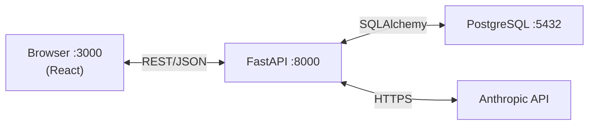
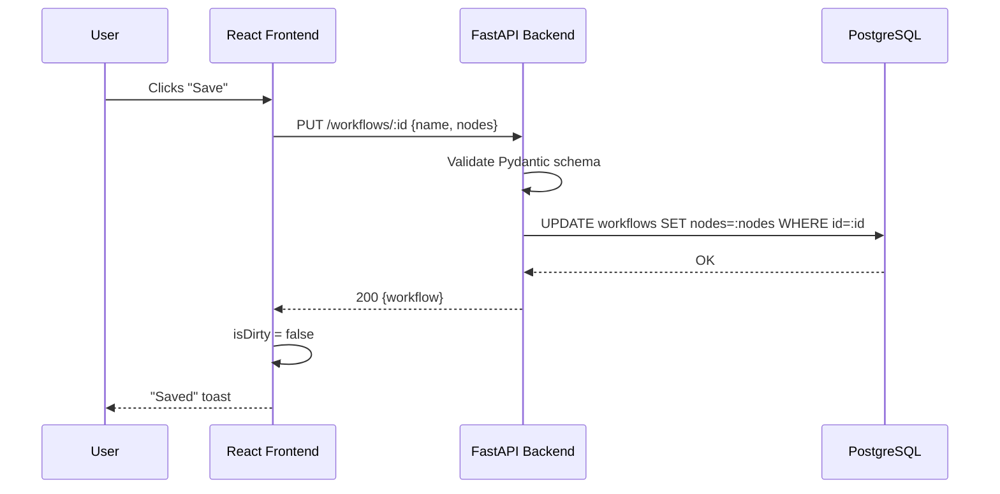
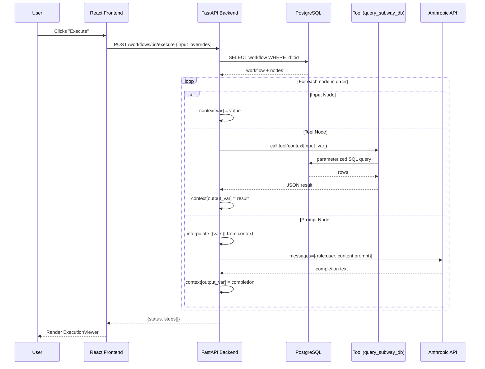

# Micro-Agent Workflow Builder — Design Spec

**Date:** 2026-05-05  
**Stack:** React + FastAPI + PostgreSQL  
**LLM:** Anthropic Claude (claude-sonnet-4-6)  
**Dataset:** Toronto Subway Delay (Kaggle, Jan 2014–Jun 2021)

---

## 1. Overview

A web application that lets users construct and execute sequential AI pipelines ("workflows") made up of typed nodes. Ships pre-configured with a Toronto Subway Data Analyst workflow that demonstrates tool calling and chain reasoning against the real TTC delay dataset.

---

## 2. Repository Layout

```
silver/
├── frontend/                  # Vite + React + TypeScript
│   ├── src/
│   │   ├── components/
│   │   │   ├── nodes/         # InputNode, ToolNode, PromptNode
│   │   │   ├── WorkflowEditor.tsx
│   │   │   ├── WorkflowList.tsx
│   │   │   └── ExecutionViewer.tsx
│   │   ├── store/             # Zustand workflow store
│   │   ├── api/               # Typed fetch wrappers
│   │   └── main.tsx
│   ├── package.json
│   └── vite.config.ts
├── backend/                   # FastAPI + SQLAlchemy + Pydantic v2
│   ├── app/
│   │   ├── api/
│   │   │   └── routes/        # workflows.py, execution.py
│   │   ├── core/
│   │   │   ├── engine.py      # Sequential execution engine
│   │   │   └── tools.py       # Tool registry
│   │   ├── models/            # SQLAlchemy ORM models
│   │   ├── schemas/           # Pydantic request/response schemas
│   │   ├── db/
│   │   │   └── seed.py        # Loads Kaggle CSVs into Postgres
│   │   └── main.py
│   ├── requirements.txt
│   └── Dockerfile
├── data/
│   ├── Toronto-Subway-Delay-Jan-2014-Jun-2021.csv
│   └── Toronto-Subway-Delay-Codes.csv
├── docker-compose.yml
└── README.md
```

---

## 3. Database Schema

### `workflows`
| Column | Type | Notes |
|---|---|---|
| id | UUID (PK) | auto-generated |
| name | TEXT | workflow display name |
| nodes | JSONB | ordered list of node configs |
| created_at | TIMESTAMPTZ | |
| updated_at | TIMESTAMPTZ | |

Nodes are stored as a JSONB array rather than a normalized table. Rationale: nodes are always read and written as a unit; a normalized schema adds joins and migration complexity with no query benefit at this scale.

### `subway_delays`
| Column | Type | Notes |
|---|---|---|
| id | SERIAL (PK) | |
| date | DATE | from CSV `Date` |
| time | TIME | from CSV `Time` |
| day | TEXT | Mon–Sun |
| station | TEXT | uppercase station name |
| code | TEXT | FK → delay_codes.code |
| min_delay | INTEGER | minutes of delay |
| min_gap | INTEGER | gap in service minutes |
| bound | TEXT | N/S/E/W |
| line | TEXT | BD / YU / SHP / SRT |
| vehicle | INTEGER | vehicle number |

### `delay_codes`
| Column | Type | Notes |
|---|---|---|
| code | TEXT (PK) | RMENU code (e.g. SUDP) |
| description | TEXT | human-readable cause |
| vehicle_type | TEXT | SUB / BUS / etc. |

Indexes: `subway_delays(station)`, `subway_delays(date)`, `subway_delays(code)`.

---

## 4. Node Types

### 4.1 Input Node
```json
{
  "id": "uuid",
  "type": "input",
  "order": 0,
  "config": {
    "variable_name": "user_query",
    "default_value": "What caused most delays at Union Station?"
  }
}
```
At execution: writes `context["user_query"] = config.default_value` (or overridden value from execute request).

### 4.2 Tool Node
```json
{
  "id": "uuid",
  "type": "tool",
  "order": 1,
  "config": {
    "tool_name": "query_subway_db",
    "input_variable": "user_query",
    "output_variable": "db_results"
  }
}
```
At execution: calls the named tool from the tool registry with `context[input_variable]` as argument. Writes result to `context[output_variable]`.

### 4.3 Prompt Node
```json
{
  "id": "uuid",
  "type": "prompt",
  "order": 2,
  "config": {
    "prompt_template": "You are a TTC analyst. Question: {{user_query}}. Data: {{db_results}}. Summarize key findings.",
    "output_variable": "analysis"
  }
}
```
At execution: replaces `{{var}}` placeholders with values from `context`, calls Claude API, writes response text to `context[output_variable]`.

---

## 5. API Endpoints

| Method | Path | Description |
|---|---|---|
| GET | /workflows | List all workflows (id, name, updated_at) |
| POST | /workflows | Create workflow, returns full object |
| GET | /workflows/{id} | Fetch single workflow with nodes |
| PUT | /workflows/{id} | Full replace of workflow + nodes |
| DELETE | /workflows/{id} | Delete workflow |
| POST | /workflows/{id}/execute | Execute pipeline, returns step results |

### Execute request body
```json
{
  "input_overrides": {
    "user_query": "What were the top delay causes on Line 1 in 2020?"
  }
}
```

### Execute response
```json
{
  "workflow_id": "uuid",
  "status": "completed",
  "steps": [
    {
      "node_id": "uuid",
      "type": "input",
      "variable": "user_query",
      "output": "What were the top delay causes on Line 1 in 2020?",
      "duration_ms": 0
    },
    {
      "node_id": "uuid",
      "type": "tool",
      "tool_name": "query_subway_db",
      "variable": "db_results",
      "output": "[{\"station\": \"UNION STATION\", ...}]",
      "duration_ms": 45
    },
    {
      "node_id": "uuid",
      "type": "prompt",
      "variable": "analysis",
      "output": "The primary causes of delays on Line 1 in 2020 were...",
      "duration_ms": 2103
    }
  ]
}
```

---

## 6. Execution Engine

File: `backend/app/core/engine.py`

```
run_workflow(workflow, input_overrides) -> ExecutionResult

  context = {}
  steps = []

  for node in sorted(workflow.nodes, key=lambda n: n.order):
    result = run_node(node, context)
    context[result.variable] = result.output
    steps.append(result)

  return ExecutionResult(steps=steps, status="completed")
```

Node runners are single-responsibility functions:
- `run_input_node(node, context)` — writes variable, instant
- `run_tool_node(node, context)` — dispatches to tool registry, awaited
- `run_prompt_node(node, context)` — interpolates template, calls Anthropic SDK, awaited

Error handling: if any node raises, execution halts, returns `status: "failed"` with the step-level error message. Prior completed steps are still included in the response.

---

## 7. Tool Registry

File: `backend/app/core/tools.py`

Two tools ship with the app:

### `query_subway_db`
Takes a natural-language question string. Uses Claude to generate a parameterized SQL query (station name / date range / line extraction), runs it against `subway_delays` + `delay_codes`, returns top results as JSON. Falls back to a broad recent-data query if extraction fails.

### `calculate_average_delay`
Accepts `{"station": str, "line": str, "start_date": str, "end_date": str}` (all optional). Returns average `min_delay` grouped by delay code description, as JSON.

Tools are registered in a dict: `TOOL_REGISTRY: dict[str, Callable] = { "query_subway_db": ..., "calculate_average_delay": ... }`. Adding a new tool is one dict entry.

---

## 8. Frontend State Management

Zustand store holds:
```ts
{
  nodes: Node[]            // ordered array, source of truth
  workflowId: string | null
  workflowName: string
  isDirty: boolean         // unsaved changes flag
  executionResult: ExecutionResult | null
  isExecuting: boolean
}
```

Key actions:
- `addNode(type)` — appends node with generated id
- `removeNode(id)` — removes, triggers validation pass
- `reorderNodes(oldIndex, newIndex)` — from dnd-kit, mutates order
- `updateNodeConfig(id, patch)` — merges config patch
- `saveWorkflow()` — PUT /workflows/:id
- `executeWorkflow(overrides)` — POST /workflows/:id/execute

**Validation** runs as a derived selector after every state change:
```ts
getValidationErrors(nodes): Record<nodeId, string[]>
```
For each node at index `i`, collects variables defined by nodes `0..i-1`. If a node references a variable not in that set, it returns an error for that node id. The editor renders a red border + message on invalid nodes.

---

## 9. Frontend Routing

| Route | Component |
|---|---|
| `/` | WorkflowList |
| `/workflows/new` | WorkflowEditor (blank) |
| `/workflows/:id/edit` | WorkflowEditor (loaded) |

Execution result renders as a collapsible panel at the bottom of the editor — no separate route needed.

---

## 10. Pre-configured Toronto Subway Workflow

Seeded into the database by `seed.py` on first startup:

```json
{
  "name": "Toronto Subway Analyst",
  "nodes": [
    {
      "type": "input",
      "order": 0,
      "config": {
        "variable_name": "user_query",
        "default_value": "What were the main causes of delays at Union Station last year?"
      }
    },
    {
      "type": "tool",
      "order": 1,
      "config": {
        "tool_name": "query_subway_db",
        "input_variable": "user_query",
        "output_variable": "db_results"
      }
    },
    {
      "type": "prompt",
      "order": 2,
      "config": {
        "prompt_template": "You are a Toronto Transit Commission data analyst. A user asked: {{user_query}}\n\nHere is the relevant subway delay data:\n{{db_results}}\n\nProvide a clear, concise summary of the key findings. Highlight the most common causes, affected stations, and any notable patterns.",
        "output_variable": "analysis"
      }
    }
  ]
}
```

---

## 11. Docker Compose

```yaml
services:
  db:
    image: postgres:15
    environment:
      POSTGRES_DB: silver
      POSTGRES_USER: silver
      POSTGRES_PASSWORD: silver
    volumes:
      - pgdata:/var/lib/postgresql/data
    ports:
      - "5432:5432"
    healthcheck:
      test: ["CMD-SHELL", "pg_isready -U silver -d silver"]
      interval: 5s
      timeout: 5s
      retries: 10

  backend:
    build: ./backend
    environment:
      DATABASE_URL: postgresql://silver:silver@db:5432/silver
      ANTHROPIC_API_KEY: ${ANTHROPIC_API_KEY}
    volumes:
      - ./data:/app/data        # CSV files visible to seed script
    ports:
      - "8000:8000"
    depends_on:
      db:
        condition: service_healthy

  frontend:
    build: ./frontend
    environment:
      VITE_API_URL: http://localhost:8000
    ports:
      - "3000:3000"
    depends_on:
      - backend
```

Backend entrypoint: run Alembic migrations → seed data (idempotent) → start Uvicorn.

One env var required from the user: `ANTHROPIC_API_KEY`.

---

## 12. Diagrams (for README)

### System Architecture


### Save Workflow Sequence


### Execute Workflow Sequence


---

## 13. What Would Change With 2 More Weeks

- **Streaming execution**: use SSE to stream each node's output as it arrives rather than waiting for full pipeline completion
- **Async parallel branches**: allow nodes at the same `order` to run concurrently
- **Execution history**: persist execution results to a DB table for replay and audit
- **Better tool input mapping**: currently tool nodes take a single input variable; a richer config would allow mapping multiple context variables to named tool parameters
- **Auth**: user accounts, per-user workflow isolation
- **Real SQL generation**: the `query_subway_db` tool currently uses Claude to extract query params; a proper text-to-SQL approach (e.g. with few-shot examples) would be more reliable
